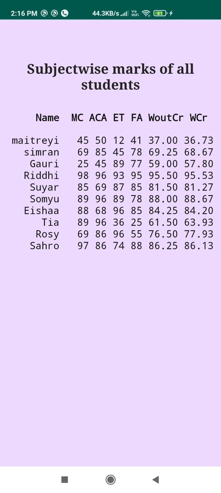

<b>Marks Calculator App</b>

Using this app, a user can:
1. Input name and subject marks of different students
2. Delete a student record from the database
3. View name, subject wise marks of all students, along with calculated percentage with and without credits, similar to university marking scheme.

It is a simple app developed in Java and uses SQLite Database to create, delete and retrieve entries.

<b>Screenshots</b>

    
 
